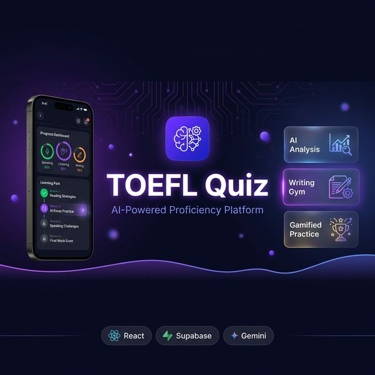

<div align="center">

# Hey, I'm Ibrohim 👋

**Full-Stack Developer** · AI/ML Enthusiast · Mobile-First Builder

[](https://www.linkedin.com/in/muhammad-ibrohim-574a962b4)
[](https://vastar.id)
[](mailto:product.director@midsolution.id)

</div>

---

## 🚀 Featured Project

<div align="center">



### 🎓 TOEFL Quiz — AI-Powered English Proficiency Platform

**A comprehensive full-stack platform for TOEFL/IELTS preparation with adaptive AI, gamification, and cross-platform support.**

[](https://reactjs.org/)
[](https://www.typescriptlang.org/)
[](https://vitejs.dev/)
[](https://tailwindcss.com/)
[](https://supabase.com/)
[](https://capacitorjs.com/)

🔒 *Private Repository — source code available for interview/review upon request*

</div>

---

### 📊 Project at a Glance

<div align="center">

| Metric | Count |
|:------:|:-----:|
| **React Components** | 100+ |
| **Services & Modules** | 57 |
| **Database Migrations** | 34 |
| **AI Prompt Pipelines** | 12 |
| **Edge Functions** | 4 |
| **Custom Hooks** | 13 |
| **Utility Modules** | 27 |
| **Lines of TypeScript** | 50,000+ |

</div>

---

### 🛠 Full Tech Stack

<div align="center">

**Frontend**


**Backend & AI**


**Mobile & Testing**


</div>

---

### ✨ Key Features

<table>
<tr>
<td width="50%">

**🧠 AI Quiz Engine**
- All 4 TOEFL sections (Structure, Written, Listening, Reading)
- 15 granular grammar skills with dedicated AI prompts
- Full TOEFL PBT Simulation (30–140 configurable questions)
- Hybrid source: DB question bank + AI generation
- PDF Upload → auto-generates quiz from any document
- Session persistence — resume mid-quiz after crash

</td>
<td width="50%">

**✍️ Writing Lab (8 Modules)**
- 🧱 **The Mason** — drag-and-drop sentence construction + leaderboards
- 🔗 **Logic Weaver** — clause connector training, 15 skill tiers
- 📈 **Complexity Ladder** — progressive sentence complexity
- 📝 **IELTS Paragraph** — Band 7+ step-by-step building
- 📖 **Integrated Writing** — read + listen (TTS) + write
- 💬 **Academic Discussion** — AI-powered academic debates
- 😈 **Devil's Advocate** — AI challenges your arguments
- ✍️ **IELTS Writing Sim** — full Band scoring + lexical heatmaps + Indoglish detection

</td>
</tr>
<tr>
<td width="50%">

**📊 Score Oracle**
- Predicts TOEFL PBT, iBT, ITP & IELTS scores
- Confidence levels with progress tracking
- Personalized improvement roadmap
- Interactive visualizations (Recharts)

</td>
<td width="50%">

**👥 Social Hub & Peer Review**
- Study Circles with invite codes
- Peer Review with rubric scoring & reviewer tiers (Novice → Master)
- Inline corrections, helpfulness ratings
- Global & circle leaderboards
- Friend system with unique codes
- Real-time notifications (Supabase Realtime)

</td>
</tr>
<tr>
<td width="50%">

**📱 Daily Bites — Creator Economy**
- TikTok-style micro-lesson player (YouTube-powered)
- Creator dashboard + analytics
- Tipping with payment gateway (Midtrans + Xendit)
- Earnings tracking & payout management
- Content moderation & admin review pipeline

</td>
<td width="50%">

**🎮 Gamification & More**
- XP, levels, streaks (with streak freeze)
- Achievement badges & unlock system
- Power-ups (hints, time extensions)
- Today's Focus — AI-recommended daily skill
- Error Jail — track & revisit wrong answers
- Vocab Hub — collect words from essays
- Guest mode with full functionality

</td>
</tr>
</table>

---

### 🏗 Engineering Highlights

```
├── 🔌 Circuit Breaker         → Prevents cascade failures from AI API outages
├── ⚡ Multi-layer Cache        → Memory → Redis (~60% API cost reduction)
├── 🚦 Sliding Window Rate Limiter → Per-user & per-service throttling
├── 🔐 Row Level Security      → 34 migrations with RLS on every table
├── 🚩 Feature Flags           → Progressive rollout system
├── 📴 Offline-First           → IndexedDB + offline queue + session persistence
├── 💾 Session Persistence     → Resume mid-exercise after refresh or crash
├── 🧩 Code Splitting          → 20+ React.lazy loaded routes
├── 🛡️ Input Validation        → Zod schemas + custom sanitization layer
├── 🔍 Content Moderation      → Automated content safety for community features
├── 📊 Observability           → Sentry + Web Vitals + custom metrics collector
├── 🧪 Comprehensive Testing   → Vitest (unit) + Playwright (E2E) + k6 (load)
├── 📱 Mobile Optimization     → Touch targets >44px, safe areas, haptic feedback
├── 💳 Payment Integration     → Midtrans + Xendit (Indonesian market)
├── 🔄 Retry Logic             → Exponential backoff with jitter
└── 📝 Documentation           → 78+ docs: API ref, runbook, rollback, readiness reports
```

---

### 🌐 Platform Support

<div align="center">

| Platform | Technology | Status |
|:--------:|:----------:|:------:|
| 🌐 Web (PWA) | Vite + vite-plugin-pwa | ✅ Production |
| 🤖 Android | Capacitor 8 | ✅ Built |
| 🍎 iOS | Capacitor 8 | ✅ Built |
| 📴 Offline | Service Worker + IndexedDB | ✅ Supported |

</div>

---

### 📊 Performance Metrics

<div align="center">

| Metric | Target | Actual |
|--------|--------|--------|
| First Contentful Paint | < 1.5s | ~1.2s |
| Time to Interactive | < 3s | ~2.4s |
| Lighthouse Performance | > 90 | 92 |
| Bundle Size (gzipped) | < 200KB | ~180KB |
| API Response (cached) | < 100ms | ~50ms |
| API Response (AI gen) | < 3s | ~2.1s |

</div>

---

<div align="center">

### 📫 Let's Connect

I'm open to opportunities and collaborations. Feel free to reach out!

**📧** product.director@midsolution.id · **💼** [LinkedIn](https://www.linkedin.com/in/muhammad-ibrohim-574a962b4) · **🌐** [vastar.id](https://vastar.id)

---

*💡 Source code is private. Available for review during interviews or upon request.*

</div>
