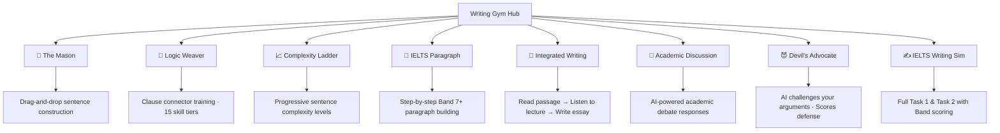
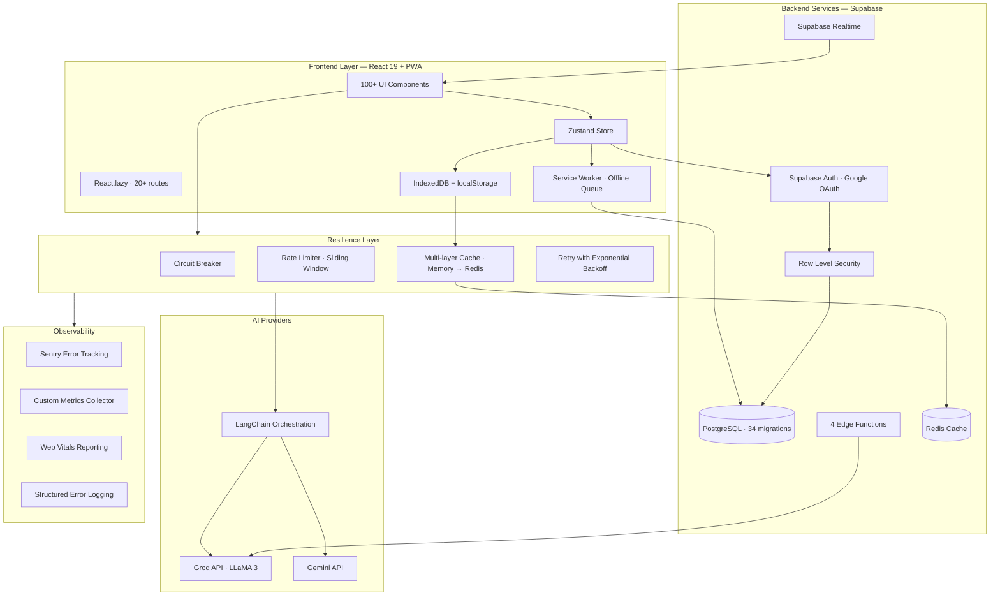
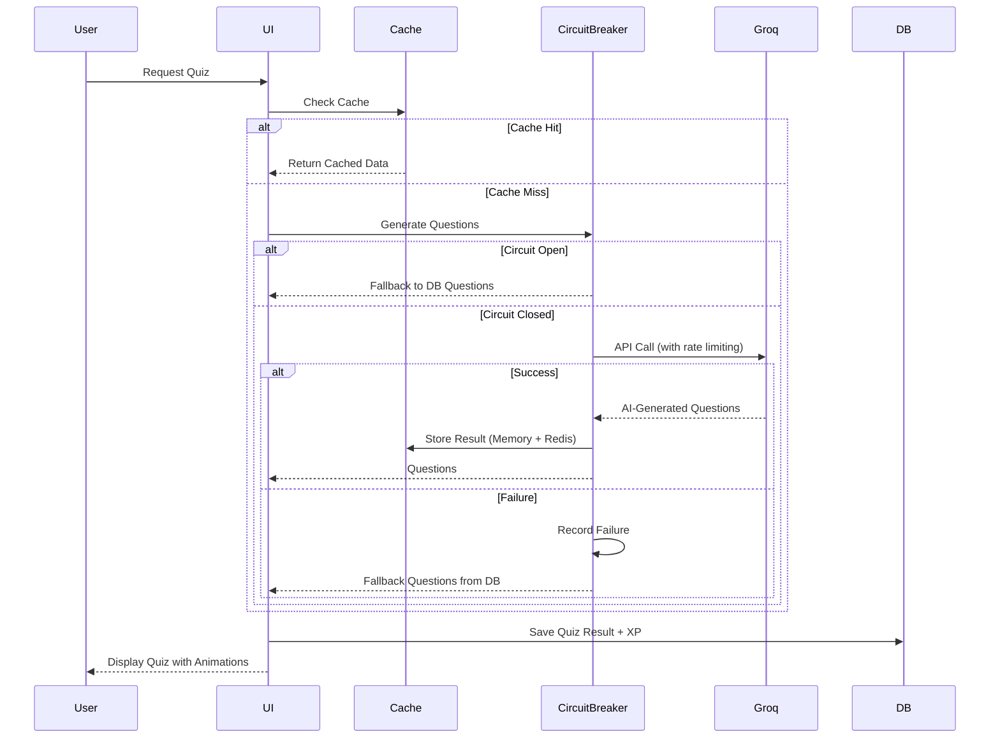

# 🎓 TOEFL Quiz — AI-Powered English Proficiency Platform

<div align="center">


**A comprehensive, AI-driven platform for TOEFL/IELTS preparation with adaptive learning, real-time feedback, and gamified practice exercises.**

[](https://reactjs.org/)
[](https://www.typescriptlang.org/)
[](https://vitejs.dev/)
[](https://tailwindcss.com/)
[](https://supabase.com/)
[](https://capacitorjs.com/)

[Features](#-key-features) • [Tech Stack](#-tech-stack) • [Architecture](#-architecture) • [Installation](#-installation) • [Mobile](#-mobile-deployment) • [Roadmap](#-roadmap)

<br/>

> [!NOTE]
> 🔒 **This is a real-world, production-grade application.**
> The source code is hosted in a **private repository** to protect intellectual property, but I am happy to provide access to:
> - 👨‍💻 **Interviewers** — to review code quality, architecture, and commit history.
> - 🤝 **Contributors** — if you're interested in collaborating on the project.
>
> **[Request Access](mailto:product.director@midsolution.id)**

</div>

---

## 📊 Project at a Glance

<div align="center">

| Metric | Count |
|:------:|:-----:|
| **React Components** | 100+ |
| **Services & Modules** | 57 |
| **Database Migrations** | 34 |
| **AI Prompt Pipelines** | 12 |
| **Edge Functions** | 4 |
| **Custom Hooks** | 13 |
| **Utility Modules** | 27 |
| **Lines of TypeScript** | 50,000+ |

</div>

---

## 📖 Overview

**TOEFL Quiz** is a full-stack Progressive Web App (PWA) and native mobile application designed to democratize access to high-quality TOEFL/IELTS preparation. Leveraging cutting-edge AI models from **Groq (LLaMA)**, **Google Gemini**, and **LangChain**, the platform generates unlimited, contextually-relevant practice questions while providing real-time feedback and personalized learning paths.

### 🎯 Problem Statement

Traditional TOEFL preparation resources are:
- **Expensive** — Premium courses cost $200–500+
- **Static** — Limited question banks become repetitive
- **Impersonal** — No adaptive learning based on weaknesses
- **Inaccessible** — Require stable internet and expensive devices

### 💡 Solution

TOEFL Quiz addresses these challenges through:
- **AI-Generated Content** — Unlimited, fresh questions tailored to skill gaps
- **Multi-Platform Access** — Web, Android, and iOS from a single codebase
- **Gamified Learning** — XP, streaks, leaderboards, and achievements
- **Offline-First** — PWA + IndexedDB + offline queue for learning anywhere
- **Community Features** — Peer review, social circles, and creator economy

---

## ✨ Key Features

### 🧠 AI-Powered Quiz Engine

<table>
<tr>
<td width="50%">

**Covers all 4 TOEFL Sections:**

| Section | Question Types | AI Provider |
|---------|---------------|-------------|
| **Structure** | Fill-in-blank (Skills 1–15) | Groq (LLaMA) |
| **Written Expression** | Error identification | Groq (LLaMA) |
| **Listening** | Audio-based MCQ with TTS | Groq + Web Speech API |
| **Reading** | Passage-based analysis | Groq |

</td>
<td width="50%">

**Advanced Features:**
- 🎯 **15 granular grammar skills** with dedicated AI prompt pipelines
- 🧪 **Full TOEFL PBT Simulation** — configurable 30–140 questions
- 🔀 **Hybrid source** — pulls from question bank first, AI fills the gap
- 📄 **PDF Upload** — upload any document → AI generates quiz from it
- 💾 **Question Bank** — save & curate questions in Supabase
- 🔄 **Session persistence** — resume mid-quiz after refresh/crash

</td>
</tr>
</table>

---

### ✍️ Writing Lab — 8 Interactive Modules



| Module | Description | Skill Focus |
|--------|-------------|-------------|
| **🧱 The Mason** | Drag-and-drop sentence construction with skill maps & leaderboards | Syntax, Word Order |
| **🔗 Logic Weaver** | Connect clauses with appropriate transitions, 15 grammar skill tiers | Coherence, Flow |
| **📈 Complexity Ladder** | Progress from simple to complex sentences with level history | Sentence Variety |
| **📝 IELTS Paragraph** | Build Band 7+ paragraphs step-by-step with band-level feedback | Academic Writing |
| **📖 Integrated Writing** | Read passage → listen to TTS lecture → write summary essay | TOEFL iBT Task 1 |
| **💬 Academic Discussion** | AI-generated academic debate prompts with AI evaluation | TOEFL iBT Task 2 |
| **😈 Devil's Advocate** | AI detects your claims, generates counter-arguments, scores your defense | Critical Thinking |
| **✍️ IELTS Writing Sim** | Full Task 1 & Task 2 simulation with AI Band scoring, lexical heatmaps, coherence flow analysis, and Indoglish detection | IELTS Writing |

**Additional Writing Resources:**
- 📚 **Band 9 Essay Library** — curated model essays with inline annotations & vocabulary collector
- 📊 **Essay Dojo Hub** — comparative analysis & sample response library
- 🤖 **AI Essay Evaluation** — detailed IELTS criteria scoring with improvement suggestions

---

### 📊 Score Oracle — AI Score Prediction

- 🎯 Predicts **TOEFL PBT, iBT, ITP, and IELTS** scores simultaneously
- 📈 Confidence levels based on data points collected
- 🗺️ Personalized improvement roadmap with actionable recommendations
- 📊 Historical progress tracking with interactive visualizations (Recharts)
- ⚙️ Toggleable score display from profile settings

---

### 👥 Social Hub & Community

<table>
<tr>
<td width="50%">

**Social Features:**
- 🔵 **Study Circles** — create/join groups with unique invite codes
- 👫 **Friend System** — add friends via unique friend codes
- 🏆 **Leaderboards** — global & per-circle XP rankings
- 🔔 **Notification Center** — real-time updates via Supabase Realtime
- 💬 **Real-time Chat** — circle messaging with Supabase Realtime

</td>
<td width="50%">

**Peer Review Hub:**
- 📝 Submit essays for community feedback
- 📋 Rubric-based scoring (Task Response, Coherence, Lexical, Grammar)
- ✏️ Inline corrections with comments
- 🏅 Reviewer tiers: Novice → Helper → Mentor → Expert → Master
- ⭐ Helpfulness ratings & author responses
- 🚫 Report system & content moderation

</td>
</tr>
</table>

---

### 📱 Daily Bites — Creator Economy

A TikTok-style micro-lesson platform with a full creator economy:

| Feature | Description |
|---------|-------------|
| 🎬 **Micro-lesson Player** | YouTube-powered short lessons with quiz integration |
| 📊 **Creator Dashboard** | Analytics, content management, audience insights |
| 💰 **Tipping System** | Payment gateway integration (Midtrans + Xendit) |
| 💸 **Earnings & Payouts** | Track earnings, request payouts to bank/e-wallet |
| 🛡️ **Content Moderation** | Admin review pipeline with approval/rejection workflow |
| 📈 **Creator Analytics** | Views, likes, tips, earnings breakdown per bite |
| 🏷️ **Categories** | Grammar Hack, Vocab Boost, Study Tip, Listening Hack, Reading Tip |

---

### 🎮 Gamification System

| Feature | Description |
|---------|-------------|
| ⚡ **XP & Levels** | Earn experience for completed activities with level progression |
| 🔥 **Streak Tracking** | Daily practice incentives with streak freeze protection |
| 🏅 **Achievements** | Unlock badges for milestones |
| 🚀 **Power-ups** | Boosters for enhanced learning (hints, time extensions) |
| 🎯 **Today's Focus** | AI-recommended daily skill based on your weaknesses |
| 🔒 **Error Jail** | Track and revisit questions you got wrong |

---

### 🔮 Additional Features

| Feature | Description |
|---------|-------------|
| 📚 **Vocab Hub** | Vocabulary building with collected words from essays |
| 🎧 **Listening Player** | TTS-powered audio with caching & preloading |
| 📄 **PDF Quiz Generator** | Upload any PDF → AI generates TOEFL-style questions |
| 🗺️ **Learning Path** | Guided progression through skills and modules |
| 📊 **Quiz Reports** | Detailed post-quiz analysis with skill breakdown |
| ⚙️ **Settings** | Profile customization, notification preferences |
| 👤 **Guest Mode** | Full functionality without sign-up (with guest ID persistence) |

---

## 🛠 Tech Stack

### Frontend

| Technology | Version | Purpose |
|------------|---------|---------|
| [React](https://reactjs.org/) | 19.2.3 | UI Framework with Concurrent Rendering |
| [TypeScript](https://www.typescriptlang.org/) | 5.8 | Type-safe development |
| [Vite](https://vitejs.dev/) | 6.2.0 | Build tool with HMR |
| [Tailwind CSS](https://tailwindcss.com/) | 4.0 | Utility-first styling |
| [Zustand](https://zustand-demo.pmnd.rs/) | 4.5.7 | Lightweight state management |
| [Framer Motion](https://www.framer.com/motion/) | 12.33.0 | Animations & micro-interactions |
| [Recharts](https://recharts.org/) | 3.7.0 | Data visualization & charts |
| [Lucide React](https://lucide.dev/) | 0.562.0 | Icon library |
| [Zod](https://zod.dev/) | 4.3.6 | Runtime input validation |
| [@dnd-kit](https://dndkit.com/) | 6.3.1 | Drag-and-drop (Mason module) |

### Backend & Services

| Service | Purpose |
|---------|---------|
| [Supabase](https://supabase.com/) | PostgreSQL, Auth, Row Level Security, Realtime, Edge Functions |
| [Redis](https://redis.io/) | Multi-layer caching (Upstash or local) |
| [Groq](https://groq.com/) | Fast AI inference with LLaMA models |
| [Google Gemini](https://ai.google.dev/) | Alternative AI generation provider |
| [LangChain](https://js.langchain.com/) | AI orchestration & prompt engineering |
| [Sentry](https://sentry.io/) | Error monitoring & performance tracking |
| [Docker](https://www.docker.com/) | Redis container via docker-compose |

### Mobile & PWA

| Technology | Purpose |
|------------|---------|
| [Capacitor](https://capacitorjs.com/) 8.0 | Native Android/iOS wrapper with haptic feedback |
| [vite-plugin-pwa](https://vite-pwa-org.netlify.app/) | Service worker, offline support, install prompts |
| IndexedDB (`idb`) | Offline data persistence |

### Testing & Quality

| Tool | Purpose |
|------|---------|
| [Vitest](https://vitest.dev/) | Unit testing with V8 coverage |
| [Playwright](https://playwright.dev/) | End-to-end testing |
| [k6](https://k6.io/) | Load testing for API endpoints |
| [ESLint](https://eslint.org/) | Code quality with import, a11y, hooks plugins |
| [Prettier](https://prettier.io/) | Code formatting |
| [Lighthouse](https://github.com/GoogleChrome/lighthouse-ci) | Performance auditing |

---

## 📁 Project Structure

```
toeflquiz/
├── src/
│   ├── components/               # 100+ React UI components
│   │   ├── writingGym/          # 30 components — 8 writing modules
│   │   │   ├── MasonLevel.tsx         # Drag-and-drop sentence builder
│   │   │   ├── LogicWeaverLevel.tsx   # Clause connector trainer
│   │   │   ├── ComplexityLadder.tsx   # Progressive sentence levels
│   │   │   ├── IELTSParagraphLevel.tsx # Band 7+ paragraph builder
│   │   │   ├── IntegratedWritingTask.tsx # Read + Listen + Write
│   │   │   ├── AcademicDiscussionTask.tsx # AI debate responses
│   │   │   ├── DevilsAdvocateLevel.tsx # AI argument challenger
│   │   │   ├── IELTSWritingSim.tsx    # Full IELTS writing simulation
│   │   │   └── band9Library/         # Model essay browser & reader
│   │   ├── peerReview/          # 13 components — peer review system
│   │   ├── dailyBites/          # Creator economy micro-lessons
│   │   ├── admin/               # Admin dashboard & review panel
│   │   ├── Dashboard.tsx        # Main dashboard with daily focus
│   │   ├── SocialHub.tsx        # Circles, friends, leaderboards
│   │   ├── ScoreOracleView.tsx  # AI score prediction
│   │   ├── SimulationView.tsx   # Full TOEFL PBT simulation
│   │   ├── PdfUploadView.tsx    # PDF → AI quiz generation
│   │   └── AppRouter.tsx        # 20+ lazy-loaded routes
│   ├── services/                # 57 service modules
│   │   ├── groq/                # AI generation engine
│   │   │   ├── generators.ts         # 60KB — all quiz generators
│   │   │   ├── prompts/              # 12 prompt template files
│   │   │   ├── client.ts             # Groq API client
│   │   │   └── circuitBreaker.ts     # AI-specific resilience
│   │   ├── cacheService.ts      # Multi-layer Redis caching
│   │   ├── aiProvider.ts        # Unified AI interface (Groq + Gemini)
│   │   ├── peerReviewService.ts # Essay submission & review system
│   │   ├── paymentGateway.ts    # Midtrans + Xendit integration
│   │   ├── moderationService.ts # Content moderation pipeline
│   │   ├── oracleScoringEngine.ts # Score prediction algorithm
│   │   ├── sessionPersistenceService.ts # Session recovery
│   │   └── featureFlagService.ts # Progressive rollout
│   ├── hooks/                   # 13 custom React hooks
│   │   ├── useAuth.ts                # Supabase authentication
│   │   ├── useQuiz.ts                # Quiz state machine
│   │   ├── useMasonGame.ts           # Mason game engine
│   │   ├── useAccessibility.tsx      # ARIA & a11y utilities
│   │   └── useNetworkStatus.ts       # Online/offline detection
│   ├── utils/                   # 27 utility modules
│   │   ├── CircuitBreaker.ts         # API resilience pattern
│   │   ├── RateLimiter.ts            # Sliding window algorithm
│   │   ├── MetricsCollector.ts       # Performance tracking
│   │   ├── inputValidation.ts        # Zod + custom sanitization
│   │   ├── contentModeration.ts      # Content safety filters
│   │   └── monitoring.ts             # Sentry + Web Vitals
│   ├── features/daily-bites/    # Daily Bites feature module
│   ├── data/                    # Static data & skill definitions
│   └── types.ts                 # 930+ lines of TypeScript definitions
├── android/                     # Capacitor Android project
├── ios/                         # Capacitor iOS project
├── supabase/
│   ├── migrations/              # 34 database migrations
│   └── functions/               # 4 Edge Functions
│       ├── groq-proxy/          # AI API proxy
│       ├── alerts/              # Monitoring alerts
│       └── cleanup-expired-claims/ # Scheduled cleanup
├── tests/
│   ├── unit/                    # 36 unit test files
│   ├── e2e/                     # 15 end-to-end tests
│   └── load/                    # k6 load test scripts
├── docs/                        # 78+ documentation files
│   ├── production-readiness/    # Production readiness reports
│   ├── api/                     # API reference documentation
│   ├── OPERATIONAL_RUNBOOK.md   # Ops runbook
│   └── ROLLBACK.md              # Rollback procedures
└── marketing-plan/              # Business & marketing docs
```

---

## 🏗 Architecture

### System Architecture



### Engineering Highlights

```
├── 🔌 Circuit Breaker         → Prevents cascade failures from AI API outages
├── ⚡ Multi-layer Cache        → Memory → Redis (~60% API cost reduction)
├── 🚦 Sliding Window Rate Limiter → Per-user & per-service throttling
├── 🔐 Row Level Security      → 34 migrations with RLS on every table
├── 🚩 Feature Flags           → Progressive rollout system
├── 📴 Offline-First           → IndexedDB + offline queue + session persistence
├── 💾 Session Persistence     → Resume mid-exercise after refresh or crash
├── 🧩 Code Splitting          → 20+ React.lazy loaded routes
├── 🛡️ Input Validation        → Zod schemas + custom sanitization layer
├── 🔍 Content Moderation      → Automated content safety for community features
├── 📊 Observability           → Sentry + Web Vitals + custom metrics collector
├── 🧪 Comprehensive Testing   → Vitest (unit) + Playwright (E2E) + k6 (load)
├── 📱 Mobile Optimization     → Touch targets >44px, safe areas, haptic feedback
├── 💳 Payment Integration     → Midtrans + Xendit (Indonesian market)
├── 🔄 Retry Logic             → Exponential backoff with jitter
└── 📝 Documentation           → 78+ docs: API ref, runbook, rollback, readiness reports
```

### Resilience Patterns

| Pattern | File | Purpose |
|---------|------|---------|
| **Circuit Breaker** | `src/utils/CircuitBreaker.ts` | Prevent cascade failures from external APIs |
| **Rate Limiting** | `src/utils/RateLimiter.ts` | Protect API quotas with sliding window algorithm |
| **Multi-layer Cache** | `src/services/cacheService.ts` | Reduce latency and API costs (~60% saving) |
| **Structured Logging** | `src/utils/monitoring.ts` | Production observability with Sentry |
| **Input Validation** | `src/utils/inputValidation.ts` | Zod + custom sanitization for all user input |
| **Content Moderation** | `src/utils/contentModeration.ts` | Safety filters for community content |
| **Offline Queue** | `src/services/offlineQueue.ts` | Queue writes when offline, sync on reconnect |
| **Session Recovery** | `src/services/sessionPersistenceService.ts` | Resume in-progress exercises after crash |
| **Feature Flags** | `src/services/featureFlagService.ts` | Toggle features without deploy |

### Data Flow — Quiz Generation



---

## 📊 Performance Metrics

| Metric | Target | Actual |
|--------|--------|--------|
| First Contentful Paint | < 1.5s | ~1.2s |
| Time to Interactive | < 3s | ~2.4s |
| Lighthouse Performance | > 90 | 92 |
| Bundle Size (gzipped) | < 200KB | ~180KB |
| API Response Time (cached) | < 100ms | ~50ms |
| API Response Time (AI gen) | < 3s | ~2.1s |

---

## 🌐 Platform Support

| Platform | Technology | Status |
|:--------:|:----------:|:------:|
| 🌐 Web (PWA) | Vite + vite-plugin-pwa | ✅ Production |
| 🤖 Android | Capacitor 8 | ✅ Built |
| 🍎 iOS | Capacitor 8 | ✅ Built |
| 📴 Offline | Service Worker + IndexedDB | ✅ Supported |

---

## 🚀 Installation

### Prerequisites

- **Node.js** >= 18.x (LTS recommended)
- **npm** or **yarn**
- **Supabase account** (free tier works)
- **Groq API key** (free tier available at [console.groq.com](https://console.groq.com))
- **Docker** (optional — for local Redis)

### Quick Start

```bash
# Clone the repository
git clone https://github.com/IbrohimMid/toeflquizgenerator.git
cd toeflquizgenerator

# Install dependencies
npm install

# Set up environment variables
cp .env.example .env.local

# Start development server
npm run dev
```

### Environment Configuration

Create `.env.local` with the following variables:

```env
# Supabase (Required)
VITE_SUPABASE_URL=your_supabase_project_url
VITE_SUPABASE_ANON_KEY=your_supabase_anon_key

# AI Providers (Required)
GROQ_API_KEY=your_groq_api_key
GEMINI_API_KEY=your_gemini_api_key

# Redis Cache (Optional — for production)
VITE_REDIS_URL=redis://localhost:6379

# Feature Flags
VITE_ENABLE_REDIS_CACHE=true
VITE_ENABLE_METRICS=true
VITE_ENABLE_ERROR_LOGGING=true

# Monitoring (Optional)
VITE_SENTRY_DSN=your_sentry_dsn
```

### Database Setup

1. Create a new Supabase project at [supabase.com](https://supabase.com)
2. Apply the 34 database migrations in order
3. Configure Row Level Security policies

### Development Commands

```bash
npm run dev          # Start dev server with HMR
npm run build        # Production build
npm run preview      # Preview production build
npm run test         # Run unit tests (Vitest)
npm run test:unit    # Run unit tests once
npm run test:coverage # Tests with V8 coverage
npm run test:load    # k6 load tests
npm run lint         # ESLint check
npm run format       # Prettier format
npm run infra:start  # Start Redis via Docker
npm run infra:stop   # Stop Redis
```

---

## 📱 Mobile Deployment

### Android

```bash
npm run build
npx cap sync android
npx cap open android    # Opens Android Studio
```

**Requirements:** Android Studio, JDK 17+, Android SDK (min SDK 22)

### iOS (macOS only)

```bash
npm run build
npx cap sync ios
npx cap open ios        # Opens Xcode
```

**Requirements:** macOS, Xcode 15+, Apple Developer Account

---

## 🗺 Roadmap

### Phase 1 — Core Platform ✅ (Completed)

- [x] AI-powered quiz generation for all 4 TOEFL sections (15 grammar skills)
- [x] Writing Lab — 8 interactive modules (Mason → IELTS Writing Sim)
- [x] Score Oracle with multi-test prediction (PBT, iBT, ITP, IELTS)
- [x] Social Hub — circles, friends, leaderboards, real-time chat
- [x] Peer Review — rubric scoring, reviewer tiers, inline corrections
- [x] Daily Bites — creator economy with tipping & payment gateway
- [x] Full TOEFL PBT Simulation (30–140 configurable questions)
- [x] PDF Upload → AI quiz generation
- [x] Gamification — XP, streaks, achievements, power-ups, error jail
- [x] Mobile apps via Capacitor (Android + iOS)
- [x] PWA with offline support, session persistence
- [x] Sentry monitoring, feature flags, content moderation
- [x] Comprehensive testing (unit + E2E + load)

### Phase 2 — Enhanced Learning (Q2 2026)

- [ ] Speaking practice with AI pronunciation feedback
- [ ] AI chat tutor for personalized assistance
- [ ] Socratic hint mode for guided learning
- [ ] Flashcards with spaced repetition algorithm

### Phase 3 — Platform Growth (Q3 2026)

- [ ] Subscription system for premium features
- [ ] Multi-language interface support
- [ ] White-label solution for institutions
- [ ] Public API for third-party integrations

---

## 📄 License

All Rights Reserved. Copyright © 2026 IbrohimMid.

This source code is provided for portfolio demonstration purposes only. No permission is granted to use, copy, modify, merge, publish, distribute, sublicense, or sell copies of this software.

---

## 🙏 Acknowledgments

- [Groq](https://groq.com/) — Lightning-fast AI inference
- [Supabase](https://supabase.com/) — Excellent backend infrastructure
- [LangChain](https://js.langchain.com/) — AI orchestration framework
- [Tailwind Labs](https://tailwindcss.com/) — Utility-first CSS framework
- [Capacitor](https://capacitorjs.com/) — Cross-platform mobile framework
- The open-source community for the amazing tools and libraries

---

<div align="center">

**Built with ❤️ for English learners worldwide**

**📧** product.director@midsolution.id · **💼** [LinkedIn](https://www.linkedin.com/in/muhammad-ibrohim-574a962b4) · **🌐** [vastar.id](https://vastar.id)

[⬆ Back to Top](#-toefl-quiz--ai-powered-english-proficiency-platform)

</div>
